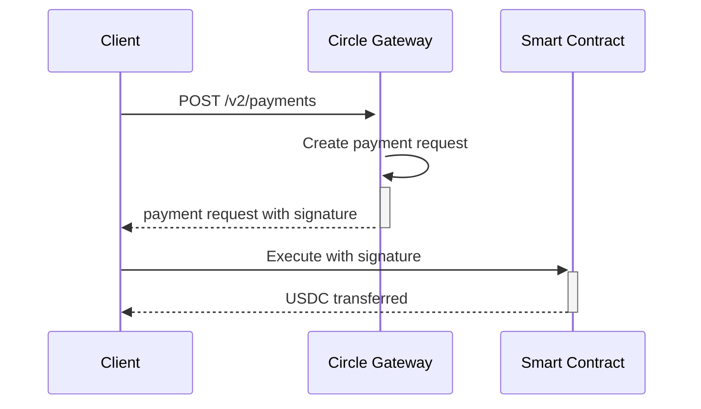

# Pulse - Deployment & Integration Status

> Last Updated: April 25, 2026

---

## 🔧 Current Status

### Demo Mode: ✅ Active
The app currently runs in **STUB_MODE**, simulating all payments locally without real Circle API integration.

---

## 🚀 Smart Contracts

### Deployed on Arc Testnet (Chain ID: 5042002)

| Contract | Status | Address | Notes |
|----------|--------|---------|--------|-------|
| PulseComputeNetwork | 🔶 Not Deployed | - | Needs deployment |
| PulseAgentIdentity | 🔶 Not Deployed | - | ERC-8004 identity |
| SpendingLimiter | 🔶 Not Deployed | - | Track C1 pattern |
| AgentEscrow | 🔶 Not Deployed | - | Track C2 pattern |
| SubscriptionManager | 🔶 Not Deployed | - | Track C3 pattern |

### Deployment Options

```bash
# Using Hardhat
cd contracts
npx hardhat run scripts/deploy.js --network arcTestnet

# Using Foundry
cd contracts
forge build
forge create --rpc-url arc_testnet --keystore . --sender deployer PulseComputeNetwork
```

---

## 👛 Circle Wallets

### Configuration Required

| Wallet Type | Status | Required Key |
|------------|--------|-------------|
| Employer Wallet | 🔶 Not Created | `CIRCLE_API_KEY` + `CIRCLE_ENTITY_SECRET` |
| Worker Wallet Set | 🔶 Not Created | `WORKER_WALLET_SET_ID` |

### Setup Steps

1. **Get Circle API Keys**
   - Sign up at https://console.circle.com
   - Create API key and entity secret

2. **Create Wallet Set**
   - Go to Developer Wallets → Wallet Sets
   - Create a new wallet set (e.g., "pulse-workers")

3. **Update .env**
   ```
   CIRCLE_API_KEY=pki_xxx
   CIRCLE_ENTITY_SECRET=ces_xxx
   WORKER_WALLET_SET_ID=wtset_xxx
   STUB_MODE=false
   ```

4. **Run Bootstrap**
   ```bash
   npm run bootstrap
   ```

---

## 💳 x402 Integration

### Current Implementation

The x402 protocol is implemented in `server/routes/x402.ts`:

| Feature | Status | Notes |
|---------|--------|-------|
| Payment Requirements | ✅ Working | `POST /api/x402/init` |
| Payment Streams | ✅ Working | `GET /api/x402/stream/:id` |
| Requirements Endpoint | ✅ Working | `GET /api/x402/requirements/:path` |
| Gateway Balance Check | ✅ Working | `GET /api/gateway/balance/:addr` |

### x402 Flow



### Integration Points

- **Circle Gateway API**: `https://gateway.circle.com/v2/payments`
- **Endpoint**: `POST /api/x402/payment-stream`
- **Requirement Format**: x402 v2 with EVM scheme

---

## 📋 Steps to Enable Live Payments

### 1. Configure Circle API

Your Circle API key format needs to include environment prefix:

```
TEST_API_KEY:24569b9eb933cd04d7f4d4e193980d45:44f774ca4b2dd353a4796f85e90cf381
```

Then register entity secret at:
- **Circle Console → Developer Wallets → Register Entity Secret**

Once registered, update `.env.local`:
```
CIRCLE_API_KEY=TEST_API_KEY:your_id:your_secret
STUB_MODE=false
```

### 2. Bootstrap Wallets

```bash
npm run bootstrap
```

This creates:
- Employer wallet
- Worker wallets
- USDC deposits

### 3. Deploy Contracts

```bash
cd contracts
npm install
npx hardhat run scripts/deploy.js --network arcTestnet
```

### 4. Verify on Explorer

- View wallet: `https://testnet.arcscan.app/address/<WALLET_ADDRESS>`
- View transactions: `https://testnet.arcscan.app/txs`

---

## 🔍 Verification Commands

### Check Wallet Balance

```bash
curl http://localhost:3001/api/gateway/balance/0xYOUR_WALLET
```

### Check x402 Stream

```bash
curl http://localhost:3001/api/x402/stream/stream_123
```

### Check Payment Requirements

```bash
curl http://localhost:3001/api/x402/requirements/inference
```

---

## 📊 Demo Mode Output

When running in STUB mode:

```
🚀 Pulse API Server
   URL:  http://localhost:3001
   Mode: STUB (no real payments)
   DB:   ./pulse.db
   Chain: ARC-TESTNET
```

To enable live mode:
1. Set `STUB_MODE=false` in `.env`
2. Add Circle API keys
3. Run `npm run bootstrap`

---

## 📞 Support

- Circle Docs: https://developers.circle.com
- **arc-escrow Sample**: https://github.com/circlefin/arc-escrow (AI-powered escrow reference)
- **Arc App Kit**: https://docs.arc.network/app-kit/bridge
- Arc Escrow Sample: https://github.com/circlefin/arc-escrow
- x402 Spec: https://x402.org
- GitHub Issues: https://github.com/Shikhyy/Pulse/issues