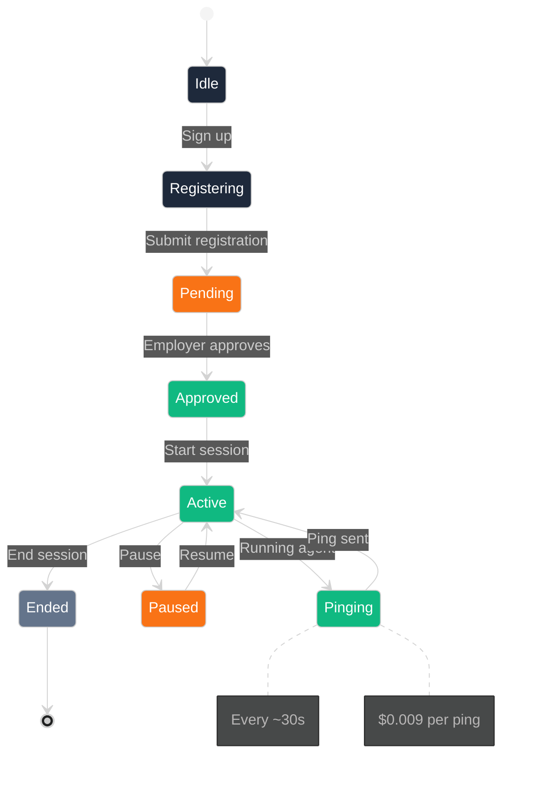

# Pulse — Autonomous Agent Compute Network

Real-time USDC payroll for AI agent compute on Arc Testnet, powered by Circle Nanopayments.

## The Problem

Traditional payment rails like Stripe have a **~30 cent minimum** per transaction. This makes it economically impossible to pay for:
- Individual AI inferences ($0.001-0.01 each)
- Per-second compute time in agent workflows
- Micro-tasks within AI pipelines

**Example:**
| Task | Traditional Cost | Feasible? |
|------|-----------------|------------|
| 1 AI inference | $0.30 min | ❌ No |
| 1 second compute | $0.30 min | ❌ No |
| 1000 micro-tasks | $300 minimum | ❌ No |

## The Solution

Pulse enables **true fractional micropayments** at **$0.009 per ping** using:

1. **Circle Nanopayments** — Sub-cent USDC transfers
2. **Arc Testnet** — Fast, cheap settlement
3. **x402 Protocol** — Web-native payment standard

**Result:** 97% cheaper than traditional payment rails

---

## How Pulse Works

### The Payment Flow

```
┌─────────────────────────────────────────────────────────────────────────────┐
│                    PULSE PAYMENT FLOW                        │
└─────────────────────────────────────────────────────────────────────────────┘

   ┌──────────┐      ┌──────────┐      ┌──────────┐      ┌──────────┐
   │ Worker   │      │ Activity │      │ Budget   │      │ Payment  │
   │ (Agent)  │─────▶│  Agent   │─────▶│  Guard   │─────▶│ Engine   │
   └──────────┘      └──────────┘      └──────────┘      └──────────┘
        │                │                 │                 │
        │            EIP-712          Verify          Circle
        │            Signature        Budget         Transfer
        │                │                 │                 │
        ▼                ▼                 ▼                 ▼
   ┌──────────┐      ┌──────────┐      ┌──────────┐      ┌──────────┐
   │  PING    │      │ SIGNED  │      │ CHECKED │      │  USDC    │
   │ 0.009   │      │  PROOF   │      │  OK     │      │ TRANSFER │
   └──────────┘      └──────────┘      └──────────┘      └──────────┘
                                                    │
                                                    ▼
                                            ┌──────────────────┐
                                            │   Arc Testnet    │
                                            │  On-Chain        │
                                            │  Settlement     │
                                            └──────────────────┘
```

### Step by Step

1. **Worker** runs an AI agent (e.g., inference node, compute provider)
2. Agent sends a **ping** every ~30 seconds with proof of work
3. **Activity Agent** signs the proof with EIP-712
4. **Budget Guard** verifies employer has sufficient budget
5. **Payment Engine** processes Circle Nanopayment
6. USDC settles on **Arc Testnet** blockchain

---

## Visual Architecture

### Complete System Diagram

```mermaid
%%{init: {'theme': 'dark', 'themeVariables': { 'darkMode': true }}}%%
flowchart TB
    subgraph Clients
        direction TB
        EMP[("Employer") subgraph EMP
            EMP1[Dashboard]
            EMP2[Wallet]
            EMP3[Budget Guard]
        end]
        
        WRK[("Worker") subgraph WRK  
            WRK1[Activity Agent]
            WRK2[Wallet]
            WRK3[Pinger]
        end]
    end
    
    subgraph Backend
        direction TB
        API[Express API]
        SIO[Socket.io]
        DB[(SQLite)]
    end
    
    subgraph Payments
        direction TB
        CE[Circle API]
        DCW[Dev Controlled Wallets]
    end
    
    subgraph Blockchain
        direction TB
        ARC[Arc Testnet]
        USDC[USDC Token]
    end
    
    EMP1 -->|HTTP| API
    EMP2 -->|Fund| DCW
    WRK1 -->|Pings| SIO
    WRK3 -->|Ping| SIO
    API -->|Verify| DCW
    API -->|Store| DB
    DCW -->|Transfer| CE
    CE -->|Settle| ARC
    ARC -->|USDC| USDC
    USDC -->|To| WRK2
    
    style EMP fill:#1e293b,stroke:#475569,color:#fff
    style WRK fill:#1e293b,stroke:#475569,color:#fff
    style API fill:#334155,stroke:#475569,color:#fff
    style SIO fill:#334155,stroke:#475569,color:#fff
    style DB fill:#334155,stroke:#475569,color:#fff
    style CE fill:#475569,stroke:#64748b,color:#fff
    style DCW fill:#475569,stroke:#64748b,color:#fff
    style ARC fill:#f97316,stroke:#fb923c,color:#fff
    style USDC fill:#10b981,stroke:#34d399,color:#fff
```

### Payment Pipeline

```mermaid
%%{init: {'theme': 'dark'}}%%
sequenceDiagram
    participant W as Worker Agent
    participant A as Activity Agent
    participant B as Budget Guard
    participant P as Payment Engine
    participant C as Circle API
    participant N as Arc Testnet
    
    W->>A: Generate work proof
    A->>A: Sign EIP-712
    A->>B: Submit signed proof
    B->>B: Verify signature
    B->>B: Check budget remaining
    B-->>A: ⚠️ Insufficient budget?
    B->>P: ✅ Budget OK
    P->>P: Check idempotency
    P->>C: Call Circle API
    C->>N: Create transaction
    N-->>C: Transaction pending
    C-->>P: Transaction ID
    P-->>A: Payment confirmed
    Note over N: USDC settles on-chain
    N->>W: Funds received
    
    style W fill:#1e293b,color:#fff
    style A fill:#1e293b,color:#fff
    style B fill:#f97316,color:#fff
    style P fill:#f97316,color:#fff
    style C fill:#334155,color:#fff
    style N fill:#10b981,color:#fff
```

### Worker Session Flow



---

## App Screenshots Description

### Landing Page
- Hero section with "Pulse — Autonomous Agent Compute Network"
- Animated agent cards showing workers
- Real-time payment demo button

### Dashboard
- Employer wallet balance
- Active workers list
- Payments per minute graph
- Total paid this session

### Worker View
- Connection status (connected/disconnected)
- Earnings in real-time
- Current session duration
- Payment history

---

## Complete Tech Stack

### Backend Technology

| Layer | Technology | Version |
|-------|------------|---------|
| Runtime | Node.js | 22.x |
| Framework | Express | 4.x |
| Real-time | Socket.io | 4.x |
| Database | SQLite | - |
| ORM | Drizzle | 0.30.x |
| Validation | Zod | 3.x |
| Auth | JWT | 9.x |
| Crypto | bcryptjs | 2.x |
| Payments | @circle-fin/developer-controlled-wallets | 10.x |

### Frontend Technology

| Layer | Technology | Version |
|-------|------------|---------|
| Framework | Next.js | 15.x |
| Bundler | Turbopack | - |
| Styling | Tailwind CSS | 3.x |
| Animation | Framer Motion | 11.x |
| State | React Hooks | - |
| HTTP | Socket.io Client | 4.x |

### Blockchain Technology

| Layer | Technology | Network |
|-------|------------|---------|
| Chain | Arc | Testnet |
| Chain ID | 5042002 | - |
| RPC | https://rpc.testnet.arc.network | - |
| Explorer | https://testnet.arcscan.app | - |
| Token | USDC | Native |
| Token Address | 0x360...000 | Arc |

### Payment Technology

| Layer | Technology |
|-------|------------|
| Payments | Circle Nanopayments |
| Protocol | x402 |
| Wallets | Circle Developer Controlled |
| API | Circle REST API |

### AI Technology

| Layer | Technology |
|-------|------------|
| Model | Gemini 2.0 Flash |
| Use Case | Dynamic pricing, Quality assessment |

---

## Build & Run

### Prerequisites

```bash
# Node.js 22+
node --version  # Should be >= 22.0.0

# npm
npm --version   # Should be >= 10.0.0
```

### Installation

```bash
# Clone the repository
git clone https://github.com/Shikhyy/Pulse.git
cd Pulse

# Install root dependencies
npm install

# Install frontend dependencies
cd frontend
npm install
cd ..
```

### Environment Setup

```bash
# Copy example environment file
cp .env.example .env.local

# Edit with your keys
nano .env.local
```

Required variables:
- `CIRCLE_API_KEY` — Get from https://console.circle.com
- `CIRCLE_ENTITY_SECRET` — Your entity secret
- `STUB_MODE=true` — For demo without real payments

### Running the App

**Development mode:**
```bash
npm run dev
```

This starts:
- Backend: http://localhost:3001
- Frontend: http://localhost:3000

**Demo mode (simulates payments):**
```bash
npm run demo
```

**Bootstrap (create initial data):**
```bash
npm run bootstrap
```

---

## API Reference

### Authentication

#### Register Worker
```bash
POST /api/auth/signup/worker
{
  "address": "0x...",
  "name": "Worker Name",
  "hourlyRate": 18
}
```

#### Register Employer
```bash
POST /api/auth/signup/employer
{
  "email": "employer@example.com",
  "password": "securepassword",
  "name": "Company Name"
}
```

#### Login
```bash
POST /api/auth/login
{
  "email": "employer@example.com",
  "password": "securepassword"
}
```

### Sessions

#### Start Session
```bash
POST /api/sessions/start
Authorization: Bearer <token>

{
  "workerId": "worker-uuid"
}
```

#### End Session
```bash
POST /api/sessions/end
Authorization: Bearer <token>

{
  "sessionId": "session-uuid"
}
```

### Payments

#### Submit Work Proof
```bash
POST /api/ping
{
  "sessionId": "session-uuid",
  "pingSeq": 42,
  "proof": "0x...",
  "signature": "0x..."
}
```

#### Get Dashboard
```bash
GET /api/employer/dashboard
Authorization: Bearer <token>
```

---

## Security Features

### EIP-712 Signatures
Every work proof is signed with EIP-712, preventing:
- Replay attacks
- Fake proof submissions
- Man-in-the-middle attacks

### JWT Authentication
Sessions are secured with JWT tokens:
- Short expiry (24 hours)
- HTTPOnly cookies
- CSRF protection

### Budget Guards
Employers set daily caps:
- Prevents overspending
- Automatic pause when reached
- Per-worker limits

### Idempotency Keys
Every payment has a unique idempotency key:
- Prevents duplicate payments
- Safe retry on network errors

---

## Unit Economics

### Cost Comparison

| Scenario | Traditional | Pulse | Savings |
|----------|-------------|-------|---------|
| 1 node, 1 min | $0.30 | $0.009 × 2 = $0.018 | 94% |
| 1 node, 1 hour | $18.00 | $1.08 | 94% |
| 5 nodes, 8 hours | $720.00 | $43.20 | 94% |

### Worker Earnings

- Rate: $0.009 per ping
- Frequency: ~120 pings/hour
- Hourly: ~$1.08/hour
- Daily (8 hours): ~$8.64/day

---

## Deployment

### Deploying Backend

**Using Render:**
1. Connect your GitHub repo
2. Set build command: `npm run server`
3. Set environment variables
4. Deploy

**Using Railway:**
1. Import GitHub repo
2. Add environment variables
3. Deploy

### Deploying Frontend

**Using Vercel:**
```bash
cd frontend
vercel deploy
```

Or connect your GitHub repo to Vercel for automatic deployments.

---

## Resources

- [Arc Documentation](https://docs.arc.network)
- [Circle Developer Docs](https://developers.circle.com)
- [x402 Protocol](https://x402.org)
- [ArcScan Explorer](https://testnet.arcscan.app)

---

## License

MIT