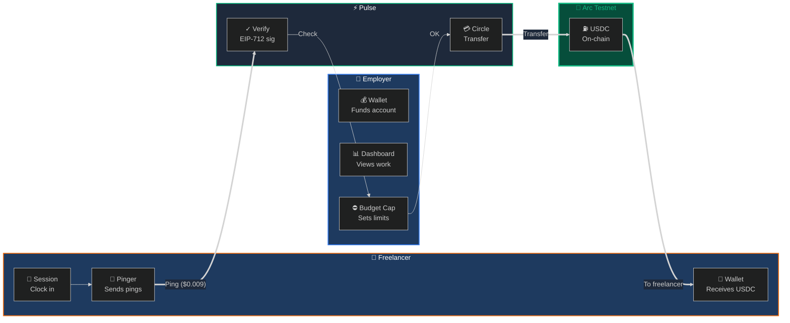
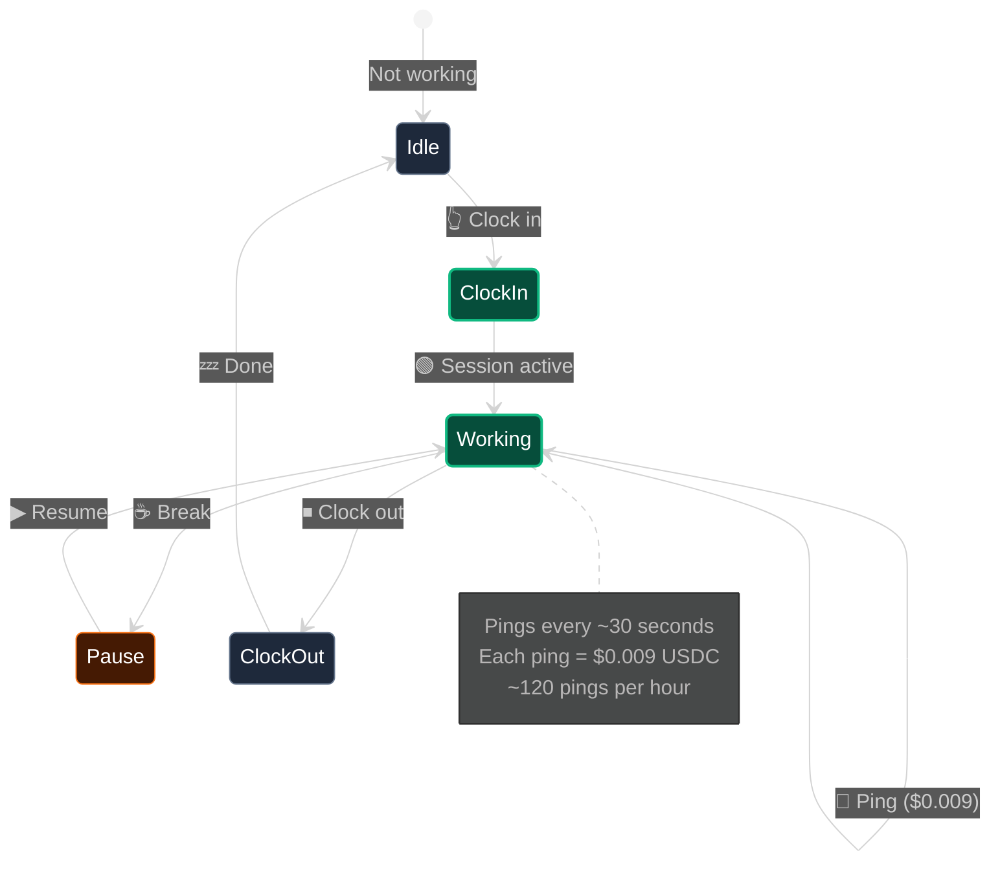

# ⚡ Pulse — Real-Time Payroll for Freelancers

<p align="center">
  <a href="https://testnet.arcscan.app/address/0x6a8bf2d11ce41f29dd7b102adb4bc42748f5acf9">
    
  </a>
  
  <a href="https://github.com/Shikhyy/Pulse">
    
  </a>
  
  
</p>

---

<p align="center">
  <b>Pay freelancers per second of work using Circle Nanopayments on Arc Testnet.</b><br />
  No minimums. No waiting. Real-time.
</p>

---

## 🎯 The Problem

Traditional payment rails have a **$0.30 minimum** per transaction. This breaks freelancer payments:

| Payment Method | Minimum | Can Pay $2 Task? |
|:------------|:-------:|:-------------:|
| Stripe | $0.30 | ❌ No |
| PayPal | $0.30 | ❌ No |
| Bank Wire | $25.00 | ❌ No |
| **Pulse** | **$0.009** | ✅ Yes |

**Also:** Freelancers wait 30 days to get paid. Employers ghost. Small tasks can't be economically paid.

---

## 💡 The Solution

**Pulse** enables per-second payments at **$0.009 per ping** (~30 seconds of work):

```
Freelancer clocks in → Pings while working → Gets paid instantly → Clocks out
```

Each ping = immediate USDC transfer to freelancer's wallet on Arc.

### Payment Flow



### Session State Machine



### Sequence Diagram

```mermaid
%%{
  init: {
    'theme': 'dark'
  }
}%%
sequenceDiagram
    participant E as 👔 Employer
    participant P as ⚡ Pulse API
    participant C as 💳 Circle
    participant A as 🔗 Arc
    
    Note over E: Funds wallet with USDC
    
    E->>P: Start session for freelancer
    P->>P: Verify employer auth
    
    rect rgb(6, 78, 59)
        Note over P,A: Worker is pinging every 30s
        loop Every 30 seconds
            P->>P: Verify EIP-712 signature
            P->>P: Check budget remaining
            P->>C: Initiate transfer
            C->>A: Submit transaction
            A-->>C: Confirm on-chain
            C-->>P: Transfer complete
            P-->>E: 💰 $0.009 transferred
        end
    end rect
    
    E->>P: End session
    P->>P: Final settlement
    P-->>E: 📊 Session summary
```

---

## 📊 Unit Economics

| Work Time | Pings | Amount Paid |
|:---------|:-----:|:---------:|
| 30 seconds | 1 | $0.009 |
| 1 hour | 120 | $1.08 |
| 8 hours | 960 | $8.64 |
| 20 days | 19,200 | $172.80 |

**Savings:** 97% cheaper than Stripe/PayPal ($0.30 min)

---

## 🛠️ Tech Stack

### Frontend
<p>
  
  
  
  
</p>

### Backend
<p>
  
  
  
  
  
</p>

### Blockchain & Payments
<p>
  
  
  
</p>

| Layer | Technology |
|:------|:----------|
| **Frontend** | Next.js 15, Tailwind CSS, Framer Motion |
| **Backend** | Node.js 22, Express, Socket.io |
| **Database** | SQLite + Drizzle ORM |
| **Blockchain** | Arc Testnet (Chain ID: 5042002) |
| **Payments** | Circle Nanopayments |
| **Wallet** | Circle Developer-Controlled |

---

## 🚀 Quick Start

### 1. Clone & Install
```bash
git clone https://github.com/Shikhyy/Pulse.git
cd Pulse
npm install
cd frontend && npm install && cd ..
```

### 2. Configure
```bash
cp .env.example .env.local
# Add Circle keys, or use STUB_MODE=true for demo
```

### 3. Run
```bash
npm run dev
```

- **Frontend:** http://localhost:3000
- **API:** http://localhost:3001

---

## 🔗 Important Links

| Resource | URL |
|:--------|:---|
| Arc RPC | `https://rpc.testnet.arc.network` |
| Arc Explorer | https://testnet.arcscan.app |
| Circle Console | https://console.circle.com |
| USDC (Arc) | `0x3600000000000000000000000000000000000000` |

---

## 📡 API Reference

| Endpoint | Method | Description |
|:---------|:------:|:-----------|
| `/api/auth/signup/worker` | POST | Freelancer signup |
| `/api/auth/signup/employer` | POST | Employer signup |
| `/api/auth/login` | POST | Login |
| `/api/sessions/start` | POST | Clock in |
| `/api/sessions/end` | POST | Clock out |
| `/api/ping` | POST | Submit work proof |
| `/api/employer/dashboard` | GET | View freelancers |

---

## 📁 Project Structure

```
pulse/
├── server/           # Backend API (Node.js + Express)
│   ├── routes/      # API routes
│   ├── agents/    # Business logic
│   └── db/        # SQLite + Drizzle
├── frontend/        # Next.js 15 app
├── scripts/        # Demo & bootstrap
└── contracts/     # Smart contracts (optional)
```

---

## 🔐 Security

- **EIP-712 Signatures** — Cryptographic proof of work
- **JWT Authentication** — Secure sessions
- **Budget Guards** — Daily spending caps
- **Idempotency Keys** — Prevent duplicate payments
- **Circle MPC Wallets** — No private key exposure

---

## 📜 License

MIT License

Copyright (c) 2026 Pulse

Permission is hereby granted, free of charge, to any person obtaining a copy
of this software and associated documentation files (the "Software"), to deal
in the Software without restriction, including without limitation the rights
to use, copy, modify, merge, publish, distribute, sublicense, and/or sell
copies of the Software, and to permit persons to whom the Software is
furnished to do so, subject to the following conditions:

The above copyright notice and this permission notice shall be included in all
copies or substantial portions of the Software.

THE SOFTWARE IS PROVIDED "AS IS", WITHOUT WARRANTY OF ANY KIND, EXPRESS OR
IMPLIED, INCLUDING BUT NOT LIMITED TO THE WARRANTIES OF MERCHANTABILITY,
FITNESS FOR A PARTICULAR PURPOSE AND NONINFRINGEMENT. IN NO EVENT SHALL THE
AUTHORS OR COPYRIGHT HOLDERS BE LIABLE FOR ANY CLAIM, DAMAGES OR OTHER
LIABILITY, WHETHER IN AN ACTION OF CONTRACT, TORT OR OTHERWISE, ARISING FROM,
OUT OF OR IN CONNECTION WITH THE SOFTWARE OR THE USE OR OTHER DEALINGS IN THE
SOFTWARE.