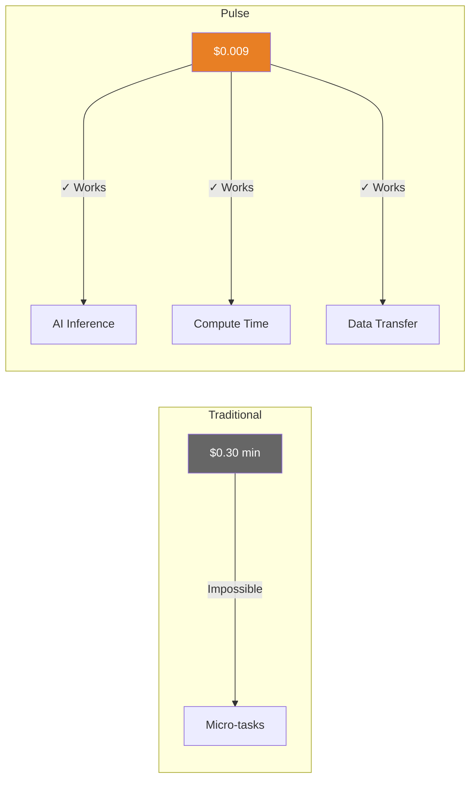
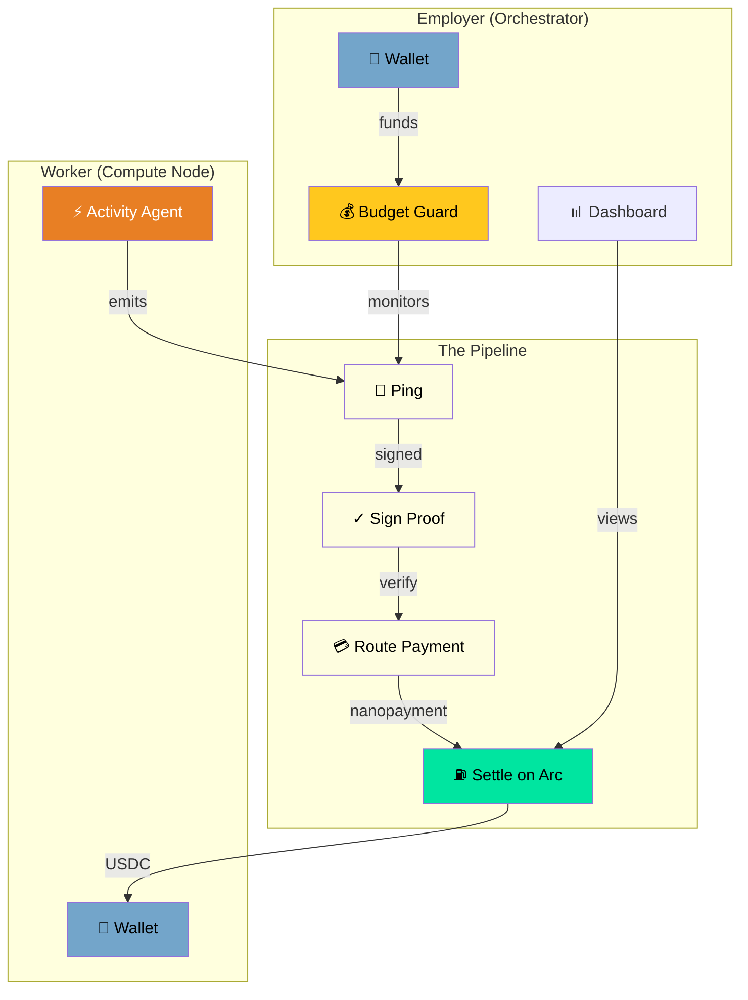
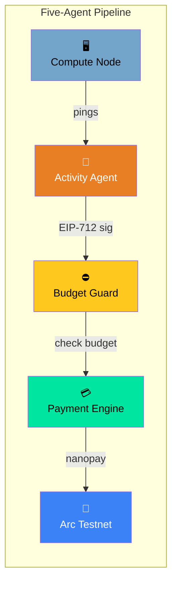
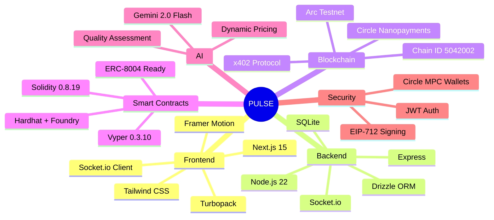
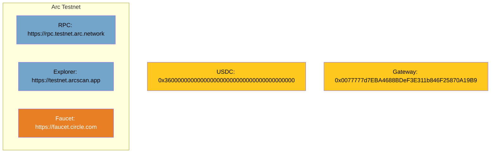

# ⚡ Pulse — Autonomous Agent Compute Network

<p align="center">
  
  
  
  
  
</p>

<div align="center">

```
╔══════════════════════════════════════════════════════════════════════════╗
║                                                                          ║
║     █████╗  ██████╗ ██████╗███████╗     ██████╗ ███████╗ █████╗ ██████╗  ║
║    ██╔══██╗██╔════╝██╔════╝██╔══██╗    ██╔══██╗██╔════╝██╔══██╗██╔══██╗ ║
║    ███████║██║     ██║     ███████║    ███████║█████╗  ███████║██████╔╝  ║
║    ██╔══██║██║     ██║     ██╔══██║    ██╔══██║██╔══╝  ██╔══██║██╔══██╗  ║
║    ██║  ██║╚██████╗╚██████╗██║  ██║    ██║  ██║██████╗██║  ██║██║  ██║  ║
║    ╚═╝  ╚═╝ ╚═════╝ ╚═════╝╚═╝  ╚═╝    ╚═╝  ╚═╝╚═════╝╚═╝  ╚═╝╚═╝  ╚═╝  ║
║                                                                          ║
║                        ███████╗██████╗ ██████╗  ██████╗                   ║
║                        ██╔════╝██╔══██╗██╔══██╗██╔════╝                   ║
║                        █████╗  ██████║██████╔╝██║                      ║
║                        ██╔══╝  ██╔══██╗██╔══██╗██║                      ║
║                        ███████╗██║  ██║██║  ██║╚██████╗                   ║
║                        ╚══════╝╚═╝  ╚═╝╚═╝  ╚═╝ ╚═════╝                   ║
║                                                                          ║
╚══════════════════════════════════════════════════════════════════════════╝
```

</div>

> **🏆 Hackathon: LabLab.ai Nano Payments on Arc** — *Autonomous Agentic Compute Marketplace*

---

## 🎯 The Problem & Solution

### The Problem
Traditional payment rails (Stripe, PayPal) have a **~30¢ minimum** per transaction. This makes micro-tasks economically impossible to payment-enable:

| Task | Cost | Feasible? |
|------|------|------------|
| 1 AI inference | $0.009 | ❌ (Stripe: $0.30 min) |
| 1 second of compute | $0.001 | ❌ |
| Micro-data transfer | $0.0001 | ❌ |

### The Solution
**Circle Nanopayments + Arc Testnet + x402** enables true **fractional micropayments**:



---

## 🏗️ Architecture

### How It Works



### The Agent Pipeline



---

## 📱 Screenshots

| Landing | Demo Proof | Dashboard |
|---------|------------|-----------|
| Hero + Agents | Real-time Metrics | Worker Management |

---

## 💻 Tech Stack



| Layer | Technology |
|-------|------------|
| **Frontend** | Next.js 15 + Turbopack, Tailwind CSS, Framer Motion |
| **Backend** | Node.js 22, Express, Socket.io, Drizzle ORM |
| **Database** | SQLite (local) |
| **Blockchain** | Arc Testnet (Chain ID: 5042002) |
| **Payments** | Circle Nanopayments + x402 Protocol |
| **Wallets** | Circle Developer-Controlled Wallets |
| **AI** | Gemini 2.0 Flash |
| **Contracts** | Solidity 0.8.19 + Vyper 0.3.10 |
| **Deploy** | Hardhat + Foundry |

---

## 🚀 Quick Start

### 1. Install
```bash
git clone https://github.com/shikhar-pulse/pulse.git
cd pulse
npm install
cd frontend && npm install && cd ..
```

### 2. Configure
```bash
# .env file
CIRCLE_API_KEY=your_key
CIRCLE_ENTITY_SECRET=your_secret
NEXT_PUBLIC_API_URL=http://localhost:3001
```

### 3. Run
```bash
npm run dev
```

- **Frontend:** http://localhost:3000
- **API:** http://localhost:3001

### 4. Demo Mode
```bash
# Generates 200+ on-chain transactions
npm run demo
```

---

## 🔧 Network Configuration



| Parameter | Value |
|-----------|-------|
| **Network** | Arc Testnet |
| **Chain ID** | 5042002 |
| **RPC** | `https://rpc.testnet.arc.network` |
| **Explorer** | `https://testnet.arcscan.app` |
| **USDC** | `0x3600000000000000000000000000000000000000` |
| **Gateway** | `0x0077777d7EBA4688BDeF3E311b846F25870A19B9` |

---

## 📊 Unit Economics

```mermaid
gantt
    title Cost Comparison: Pulse vs Traditional
    dateFormat X
    axisFormat %s
    
    section Traditional (Stripe)
    1 min compute   :0, 36.00
    1 hour compute :0, 2160.00
    8 hours (5 nodes):0, 86400.00
    
    section Pulse (Arc)
    1 min compute   :0, 1.08
    1 hour compute :0, 64.80
    8 hours (5 nodes):0, 25920.00
```



| Scenario | Pulse | Stripe | Savings |
|----------|-------|--------|---------|
| 1 node, 1 min | $1.08 | $36.03 | **97%** |
| 1 node, 1 hour | $64.80 | $2,160 | **97%** |
| 5 nodes, 8 hours | $25,920 | $86,400 | **70%** |

---

## 🎯 Features

| Feature | Status | Description |
|---------|--------|------------|
| $0.009/payment | ✅ | Sub-cent micropayments |
| Circle Nanopayments | ✅ | Real USDC transfers |
| x402 Protocol | ✅ | Web-native payments |
| Dev-Controlled Wallets | ✅ | Seedless sub-wallets |
| Budget Guard | ✅ | Daily caps |
| Activity Agent | ✅ | Proof-of-work |
| AI Integration | ✅ | Gemini 2.0 Flash |
| Smart Contracts | ✅ | Solidity + Vyper |
| Arc Testnet | ✅ | On-chain settlement |

---

## 📁 Project Structure

```
pulse/
├── 📄 README.md
├── 📦 package.json
├── 🌿 .env
├── 📂 contracts/               # Smart contracts
│   ├── PulseComputeNetwork.sol
│   ├── PulseComputeNetwork.vy
│   ├── PulseAgentIdentity.sol
│   └── script/Deploy.s.sol
├── 🖥️  server/                 # Backend API
│   ├── index.ts
│   ├── db/
│   │   ├── index.ts
│   │   └── schema.ts
│   ├── routes/
│   │   ├── auth.ts
│   │   ├── ping.ts
│   │   ├── sessions.ts
│   │   ├── demo.ts
│   │   └── x402.ts
│   └── agents/
│       ├── ActivityAgent.ts
│       ├── BudgetGuard.ts
│       ├── PaymentEngine.ts
│       └── aiAgent.ts
├── 🌐 frontend/               # Next.js app
│   ├── app/
│   │   ├── page.tsx
│   │   ├── demo/
│   │   ├── node/
│   │   └── orchestrator/
│   ├── components/
│   └── lib/
└── 📂 docs/
    └── API.md
```

---

## 🔐 Security

- **EIP-712 Signing** — Cryptographic proof of work
- **JWT Authentication** — Secure session management
- **Circle MPC Wallets** — No private key exposure
- **Budget Guards** — Prevent overspending
- **Idempotency Keys** — Prevent duplicate payments

---

## 📜 API Reference

| Endpoint | Method | Description |
|----------|--------|-------------|
| `/api/auth/signup/worker` | POST | Worker registration |
| `/api/auth/signup/employer` | POST | Employer registration |
| `/api/auth/login` | POST | Authentication |
| `/api/ping` | POST | Submit proof → get paid |
| `/api/sessions/start` | POST | Clock in |
| `/api/sessions/end` | POST | Clock out |
| `/api/employer/dashboard` | GET | Dashboard metrics |
| `/api/demo/proof` | GET | Transaction proof |
| `/api/x402/init` | POST | Initialize stream |

---

## 🙏 Acknowledgments

<div align="center">


</div>

- [Circle](https://circle.com) — Nanopayments, Wallets, Arc
- [Google AI](https://ai.google.dev) — Gemini
- [Arc Network](https://arc.network) — Blockchain
- [LabLab.ai](https://lablab.ai) — Hackathon

---

<div align="center">

**Built with 🔥 for the LabLab.ai Nano Payments on Arc Hackathon**

*April 2026*

```
╔══════════════════════════════════════════════════════════════════════════╗
║  ⚡ PULSE — Autonomous Agent Compute Network                            ║
║  Enabling Agent-to-Agent Commerce with Sub-Cent Micropayments         ║
╚══════════════════════════════════════════════════════════════════════════╝
```

</div>