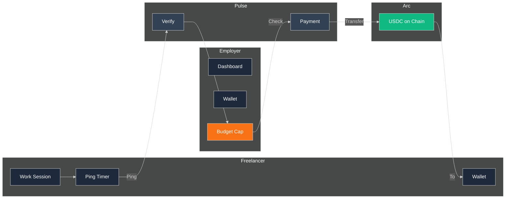
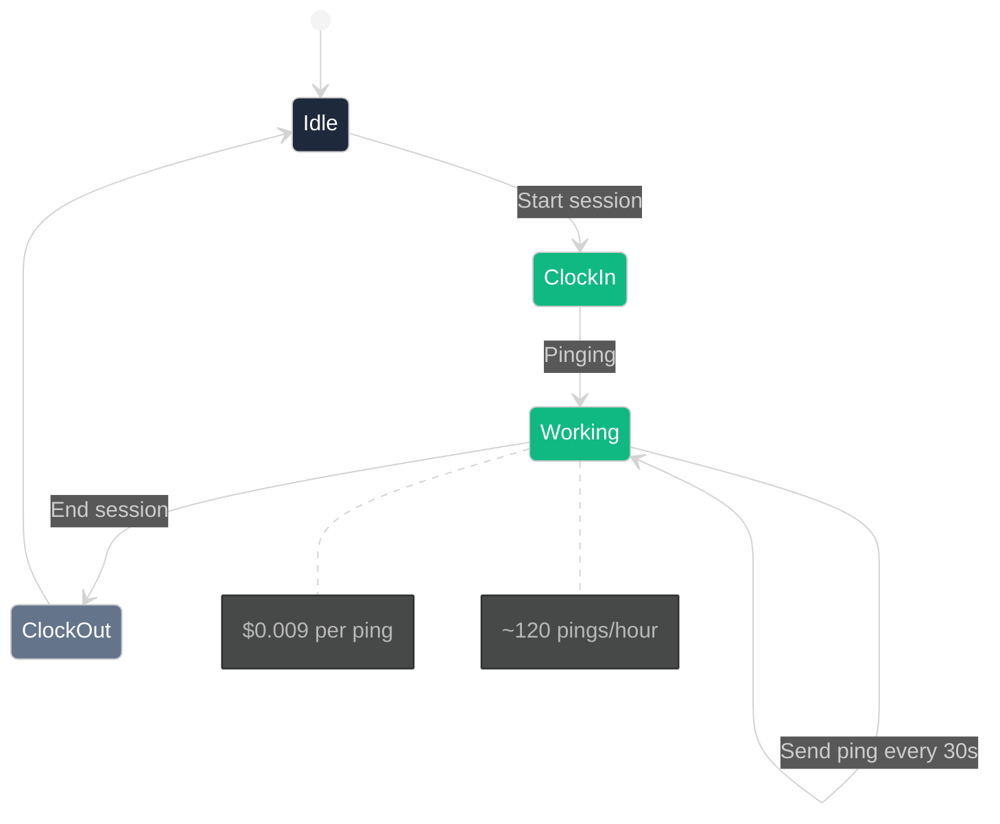

# Pulse — Real-Time Payroll for Freelancers

Pay freelancers per second of work using Circle Nanopayments on Arc Testnet.

## The Problem

Traditional payment rails (Stripe, PayPal) have a **~30 cent minimum** per transaction. This makes it impossible to pay freelancers fairly for:

- Small tasks or micro-gigs
- Per-hour or per-minute work
- Contracted pieces of work

**Example:**
| Payment Method | Minimum | Freelancer Gets |
|-------------|--------|--------------|
| Stripe | $0.30 | Can't pay for 5-min job |
| PayPal | $0.30 | Can't pay for small tasks |
| Wire | $25+ | Only for large payments |

## The Solution

**Pulse** enables fractional payments at **$0.009 per ping** (~30 seconds of work). Freelancers get paid continuously while working, not in lump sums at the end of the month.

### How It Works

1. **Employer** funds their account with USDC
2. **Freelancer** starts a work session 
3. Freelancer sends **pings** while working (every ~30 seconds)
4. Each ping = **$0.009** → immediate USDC payment
5. Employer sees work in real-time on dashboard

### Payment Flow

```
Freelancer → Signs in → Starts session → Pings while working → 
Budget Guard checks funds → Payment Engine transfers → USDC to freelancer
```

---

## Visual Design

### Payment Flow



### Session Flow



---

## Tech Stack

| Layer | Technology |
|-------|------------|
| Frontend | Next.js 15, Tailwind CSS, Framer Motion |
| Backend | Node.js 22, Express, Socket.io |
| Database | SQLite + Drizzle ORM |
| Blockchain | Arc Testnet (Chain ID: 5042002) |
| Payments | Circle Nanopayments |
| Wallet | Circle Developer-Controlled |

---

## Run Locally

```bash
git clone https://github.com/Shikhyy/Pulse.git
cd Pulse
npm install
cd frontend && npm install && cd ..

# Update .env.local with keys, or use STUB_MODE=true
npm run dev
```

- Frontend: http://localhost:3000
- API: http://localhost:3001

---

## Configuration

.env.local:
```
# Circle API (get from console.circle.com)
CIRCLE_API_KEY=your_key
CIRCLE_ENTITY_SECRET=your_secret

# Or demo mode
STUB_MODE=true
```

---

## API

| Endpoint | Method | Description |
|---------|--------|-------------|
| `/api/auth/signup/worker` | POST | Freelancer signup |
| `/api/auth/signup/employer` | POST | Employer signup |
| `/api/auth/login` | POST | Login |
| `/api/sessions/start` | POST | Clock in |
| `/api/sessions/end` | POST | Clock out |
| `/api/ping` | POST | Submit work proof |
| `/api/employer/dashboard` | GET | View freelancers |

---

## Unit Economics

| Payment | Amount |
|---------|--------|
| Per ping | $0.009 |
| Per hour (~120 pings) | $1.08 |
| Per day (8 hours) | $8.64 |
| Per month (20 days) | $172.80 |

---

## Deployment

**Frontend**: Vercel
**Backend**: Render / Railway

---

## License

MIT